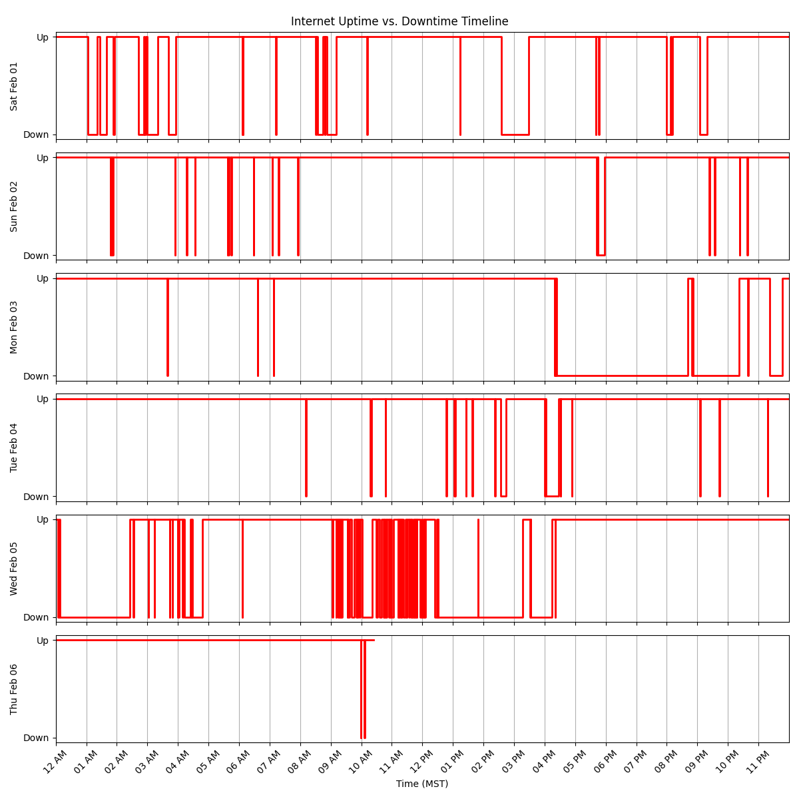

# Netcheck Graph

This project is an extension of [netcheck](https://github.com/TristanBrotherton/netcheck), designed to visualize internet connectivity over time using a seismograph-like graph. It parses logs from netcheck, converts timestamps to MST, and generates a daily timeline showing when the internet was up or down.

## Features
- Parses netcheck logs to extract downtime and uptime events.
- Converts timestamps to Mountain Standard Time (MST).
- Generates a daily step-plot graph showing internet connectivity.
- Automatically updates the graph when the log file changes.

## Installation
### Step 1: Install Python
Ensure you have Python installed. You can download it from [python.org](https://www.python.org/downloads/).

To check if Python is installed, run:
```sh
python --version
```

### Step 2: Install Dependencies
Use the following command to install required dependencies:
```sh
pip install matplotlib pytz watchdog
```

### Step 3: Clone the Repository
```sh
git clone https://github.com/Deedsogado/NetCheckGraph.git
cd netcheckgraph
```

## Usage
1. Ensure `netcheck` is running and generating logs.
2. Update the `LOG_FILE` variable in `netcheck_timeline.py` to match your log file location.
3. Run the script:
   ```sh
   python netcheck_timeline.py
   ```
4. The script will generate `netcheck_timeline.png` showing uptime and downtime.
5. The script will also monitor the log file and regenerate the graph when updates occur.

## Example Output
The output graph organizes days in stacked rows, aligning times across days for clarity.



## License
This project is licensed under the GPL-3.0 License.

## Credits
Inspired by [Tristan Brotherton's netcheck](https://github.com/TristanBrotherton/netcheck).

